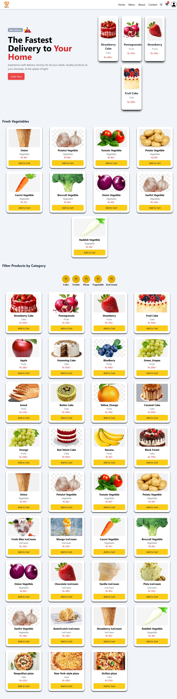
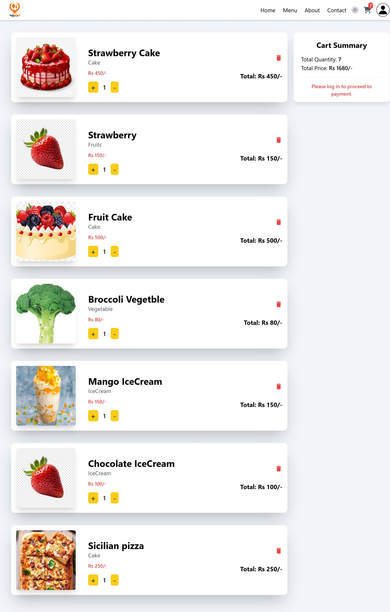

# 🍽️ FLAVOR FUSION FOOD APP | 🍕🍔🥗🍜🍣

Welcome to Flavor Fusion, the ultimate food ordering experience! Whether you're craving a quick bite or a gourmet meal, our modern app lets you browse, customize, and order your favorite dishes effortlessly. Built with React.js, Redux, and TailwindCSS, this app delivers a seamless experience with a sleek, intuitive UI and powerful backend. 🍲✨

## ✨ Key Features

 
✅ **Dynamic Menu & Categories** - Explore an extensive menu sorted by cuisine types. 🍣🍛  
✅ **Real-time Cart Management** - Add, remove, and update items in your cart instantly. 🛒  
✅ **Secure Payments with Stripe** - Fast, encrypted, and hassle-free transactions. 💳  
✅ **Dark Mode Support** - Choose between light and dark themes for a personalized experience. 🌙  
✅ **Admin Panel for Management** - Easy menu and order handling for restaurant owners. 🏪  
✅ **User Authentication & Profiles** - Secure login, order history tracking, and profile customization. 🔐  
✅ **Smooth Animations & Transitions** - Enhanced user engagement with sleek animations. 🎭  
✅ **Fast Loading Performance** - Optimized for speed and efficiency. 🚀  

## Screenshots

## Tech Stack

**✅ Frontend::**  React.js, Redux, TailwindCSS 📚

**✅ Backend:** Node.js, Express.js 🛠️

**✅  Database:** MongoDB 📊

**✅  Authentication:** JWT (JSON Web Token) 🔐

**✅ Payments:** Stripe API 💳

**✅  Deployment:** Vercel🌐

## 🛍️ Usage Guide

- Browse Menu - Explore different categories and choose your favorite dishes.
- Add to Cart - Customize and manage your order before checkout.
- Secure Payment - Use Stripe for fast and safe transactions.
-  Admin Panel - Restaurant owners can add items from the menu.

## 🔗 Links

